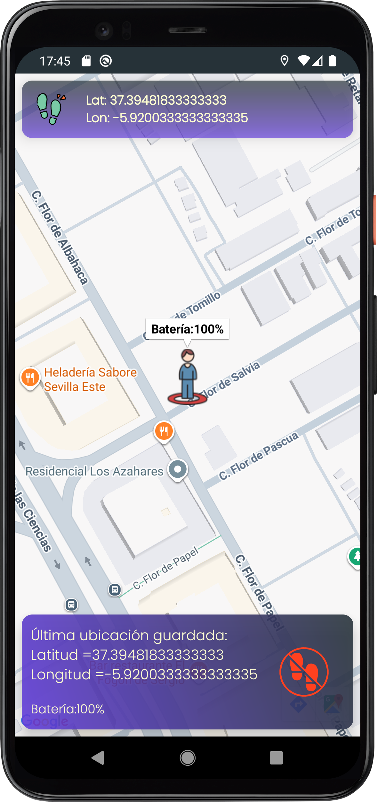
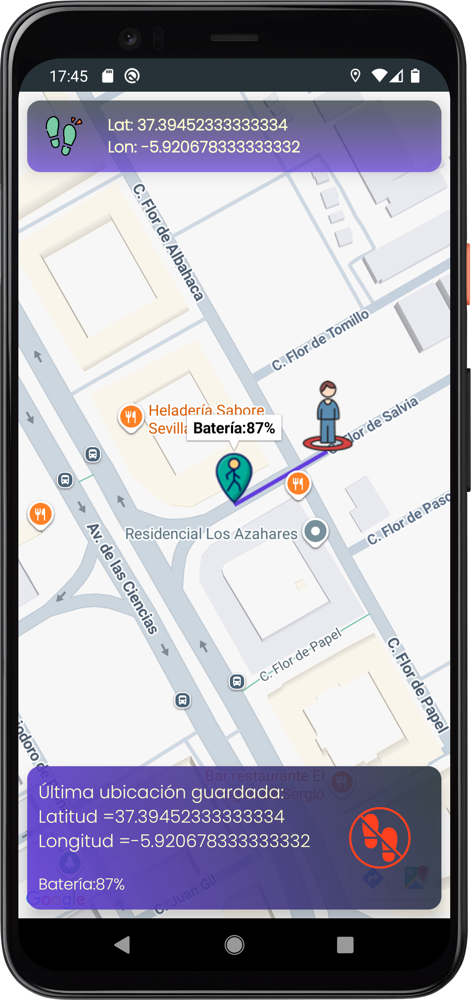
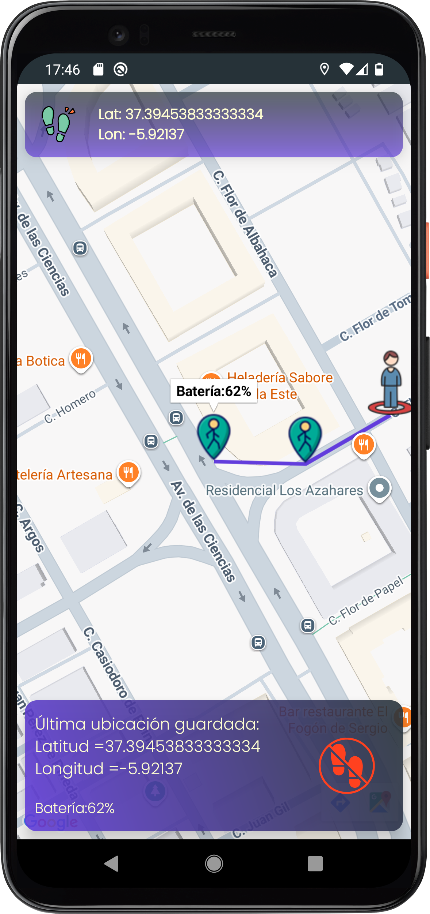
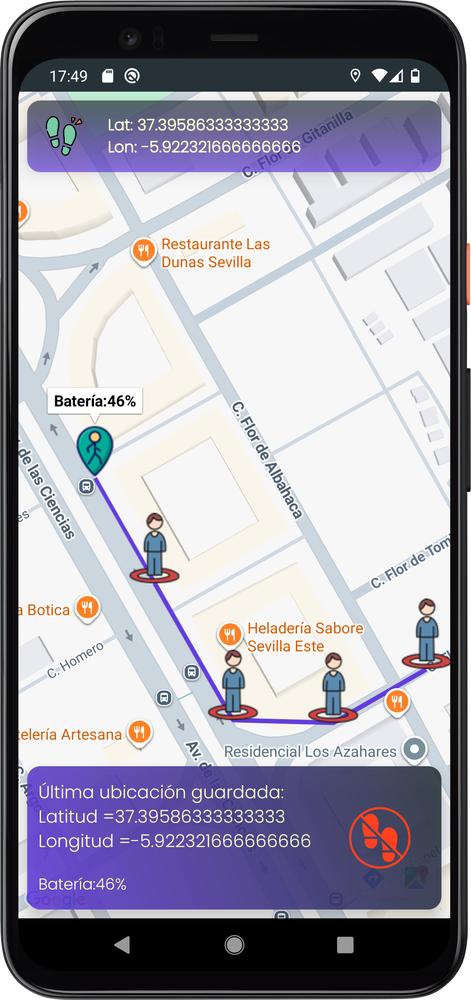
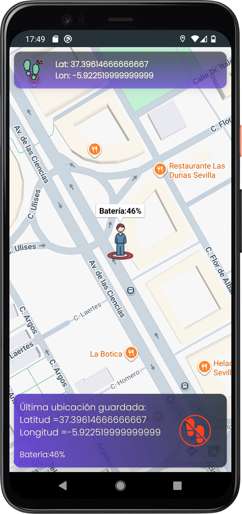

# PasitosApp

> App Android de rastreo de rutas en tiempo real con Google Maps, GPS y persistencia SQLite · Java

Aplicación Android para registrar rutas a pie sobre un mapa en tiempo real. Traza la ruta recorrida mediante una línea sobre Google Maps, guarda cada punto de la ruta en una base de datos local y muestra en cada marcador el nivel de batería del dispositivo en ese momento. Si cierras y reabres la app, la ruta se reconstruye automáticamente desde la base de datos.

---

## Capturas de pantalla

<table>
  <tr>
    <td align="center"><br/><sub>Inicio — posición actual</sub></td>
    <td align="center"><br/><sub>Primer tramo registrado</sub></td>
    <td align="center"><br/><sub>Ruta en progreso</sub></td>
  </tr>
  <tr>
    <td align="center"><br/><sub>Ruta recuperada al reabrir</sub></td>
    <td align="center"><br/><sub>Ruta reiniciada</sub></td>
    <td align="center"></td>
  </tr>
</table>

---

## Funcionalidades

- **Rastreo GPS en tiempo real**: la posición del usuario se actualiza automáticamente cada 60 segundos mediante un `Handler`, desplazando el marcador principal y extendiendo la ruta
- **Trazado de ruta con Polyline**: cada nueva posición añade un segmento a la línea que se dibuja sobre el mapa, mostrando visualmente el recorrido completo
- **Marcadores con batería**: al guardar cada punto se coloca un marcador en el mapa; al pulsarlo muestra el nivel de batería del dispositivo en ese momento
- **Persistencia en SQLite**: cada punto registrado (latitud, longitud y batería) se guarda en base de datos local. Al reabrir la app, la ruta completa se reconstruye desde la BD — marcadores y polyline incluidos
- **Panel de información**: cabecera con coordenadas actuales en tiempo real y pie con los datos del último punto guardado
- **Reinicio de ruta**: borra todos los registros de la BD, limpia el mapa y comienza una nueva ruta desde cero

---

## Funcionamiento interno

```
onCreate()
    └─► Carga la ruta guardada desde SQLite → dibuja marcadores y polyline en el mapa
    └─► Inicia el LocationManager con LocationListener
    └─► Lanza el Handler con bucle de 60 segundos

LocationListener.onLocationChanged()
    └─► Actualiza coordenadas en pantalla
    └─► Mueve el marcador de posición actual

Handler (cada 60 segundos) → guardarUbicacion()
    └─► Obtiene posición actual (lat, lon)
    └─► Lee nivel de batería con BatteryManager + IntentFilter
    └─► Inserta registro en SQLite (lat, lon, batería)
    └─► Añade marcador al mapa con batería como info
    └─► Extiende la Polyline con el nuevo punto
    └─► Actualiza el panel inferior con el último punto guardado
```

La reconstrucción de ruta al reabrir la app recorre todos los registros de la tabla con un `Cursor`, añade cada punto a la `PolylineOptions` y coloca su marcador correspondiente antes de dibujar la línea de una sola vez.

---

## Tecnologías

| Tecnología | Uso |
|-----------|-----|
| **Java** | Lenguaje principal |
| **Google Maps SDK** | Mapa interactivo, marcadores y Polyline |
| **LocationManager / LocationListener** | Rastreo GPS en tiempo real |
| **BatteryManager + IntentFilter** | Lectura del nivel de batería del sistema |
| **SQLite (SQLiteOpenHelper)** | Persistencia local de puntos de la ruta |
| **Handler + Runnable** | Bucle de actualización periódica (60 s) |
| **Android Studio** | Entorno de desarrollo |

---

## Aprendizajes clave

- Integración de **Google Maps SDK**: configuración de API key, implementación de `OnMapReadyCallback`, gestión de marcadores y trazado de `Polyline`
- Uso de **`LocationManager`** con permisos en tiempo de ejecución (`ACCESS_FINE_LOCATION`) y gestión del ciclo de vida del listener
- Lectura de **sensores del sistema** (batería) mediante `BatteryManager` y `IntentFilter` sin necesitar permisos adicionales
- **Persistencia con SQLite puro** usando `SQLiteOpenHelper`, `ContentValues` y `Cursor` para operaciones CRUD sin ORM
- Coordinación de un **`Handler` periódico** con el estado del mapa para actualizar UI y BD de forma sincronizada
- Diseño de una estrategia de **recuperación de estado** al reabrir la app, reconstruyendo la ruta completa desde la base de datos local

---

*Desarrollado como proyecto del CFGS en Desarrollo de Aplicaciones Multiplataforma (DAM) — Grupo Studium Formación, Sevilla.*
